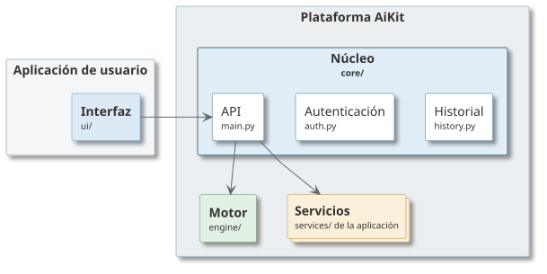

# AiKit

_Framework_ modular para incorporar asistentes conversacionales basados en IA generativa a
aplicaciones web ya existentes, con bajo acoplamiento y configuración declarativa.

La idea central es que la aplicación no tenga que implementar la conexión con el proveedor de
modelo, el ciclo de invocación de herramientas, la identificación del usuario ni la persistencia
del historial. Solo aporta su lógica de negocio, expuesta como un servicio, y decide el resto
mediante un fichero de configuración.

## Arquitectura



AiKit se organiza en capas desacopladas, cada una con un directorio propio:

- `aikit/core/`: API HTTP, carga de configuración, orquestación de herramientas, resolución de
  identidad y gestión del historial. Contiene también los contratos que deben cumplir el resto
  de componentes.
- `aikit/engine/`: conectores con proveedores de modelo. Se selecciona uno por configuración.
- `aikit/ui/`: componentes de interfaz reutilizables: un widget de chat web y un cliente de
  terminal.
- `examples/`: casos de uso completos y ejecutables.

Los servicios de dominio no forman parte del _framework_: los aporta cada aplicación en su
propio directorio `services/` y se registran mediante configuración.

El núcleo desconoce tanto el proveedor de modelo concreto como el dominio de la aplicación:
ambos se conectan a través de contratos explícitos.

## Requisitos

- Python 3.10 o superior.
- Las dependencias de `requirements.txt`.
- Credenciales del proveedor de modelo elegido. Con Amazon Bedrock basta un perfil de AWS
  configurado; con Ollama, el servicio ejecutándose en local.

```bash
python3 -m venv .venv
source .venv/bin/activate
pip install -r requirements.txt
```

## Puesta en marcha

El modo más rápido de ver el sistema en funcionamiento es el ejemplo `demo`, que incluye varios
servicios de dominio:

```bash
cd examples/demo
./run.sh
```

El servicio queda disponible en el puerto 8000. Para comprobarlo:

```bash
curl -X POST http://localhost:8000/chat \
  -H "Content-Type: application/json" \
  -d '{"message": "que hay en el trastero?"}'
```

El ejemplo `examples/armarios-mario` muestra un caso completo con interfaz web incluida, y
dispone de su propio `README.md`.

## Puntos de acceso

| Método y ruta | Descripción |
|---|---|
| `POST /chat` | Envía un mensaje al asistente y devuelve su respuesta |
| `POST /session` | Emite una sesión anónima firmada (modo de autenticación `cookie`) |
| `GET /conversations` | Lista las conversaciones del usuario actual |
| `GET /conversations/{id}` | Devuelve los mensajes de una conversación |
| `GET /health` | Comprobación de vida del proceso |
| `GET /readiness` | Comprobación de que motor, servicios e historial están inicializados |

## Documentación

- [Crear un servicio de dominio](docs/crear-un-servicio.md): cómo exponer la lógica de la
  aplicación al asistente. Es el punto de extensión habitual.
- [Integrar la interfaz conversacional](docs/integrar-la-interfaz.md): cómo incrustar el widget
  de chat en una web existente.
- [Configuración](docs/configuracion.md): referencia del fichero `aikit.yaml`.
- [Crear un conector de motor](docs/crear-un-motor.md): cómo añadir soporte para otro proveedor.
- [Problemas frecuentes](docs/problemas-frecuentes.md): errores habituales y su solución.

Los ejemplos disponen de su propia documentación: [demo](examples/demo/README.md), una
integración mínima con varios servicios;
[armarios-mario](examples/armarios-mario/README.md), un caso completo con interfaz web; y
[sysadmin](examples/sysadmin/README.md), un asistente de administración de sistemas con
interfaz de terminal.

El fichero `aikit.yaml` de la raíz documenta todas las opciones disponibles y sirve como
referencia; no se utiliza en ejecución, ya que cada integración mantiene el suyo y lo indica
mediante la variable de entorno `AIKIT_CONFIG`.

## Licencia

Licencia MIT.
Consultar fichero LICENSE para mas detalles.
